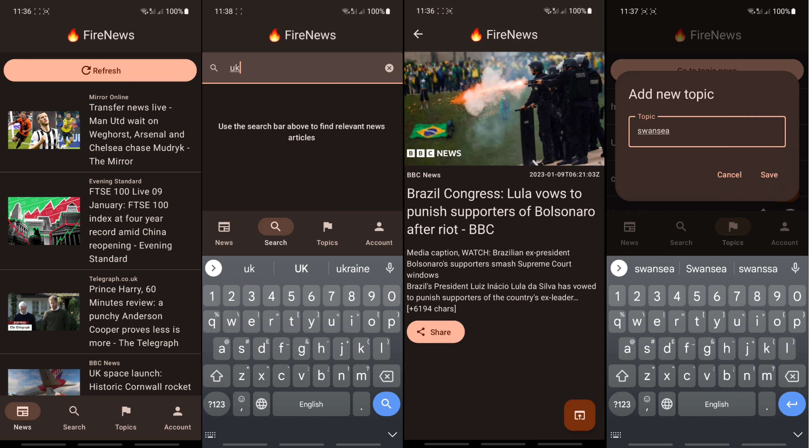

# **🔥FireNews** Mobile App



## About

This is an Android mobile app created as part of my University course. It is a news aggregator app that supports user accounts with saved topics for getting news alerts.

The app is written in **Jetpack Compose**. Backend accounts and user storage is done using **Firebase**. Major architecture decisions include using **ViewModel**s and **Hilt** (Dagger) dependency injection.

## Features

**Home** - List of latest top headlines, clicking on an article will take you to it's detail page

**Article Detail** - More specific information on an article, content, time, content.

**Search** - Enter a key term and get relevant news in list format

**Accounts** - You can login (or browse anonymously), and save topics you want to receive notifications for.

**Topics** - Enter a topic you are interested in. Every so often a worker will execute and scan the latest news for your interested topics. If anything is found a notification is sent.

## How to run

1. Add a `secrets.xml` to `res/values`, containing:

```XML
<?xml version="1.0" encoding="utf-8"?>
<resources>
    <string name="news_api_key">put_key_here</string>
</resources>
```

2. Go to firebase and add the `google-services.json` file
